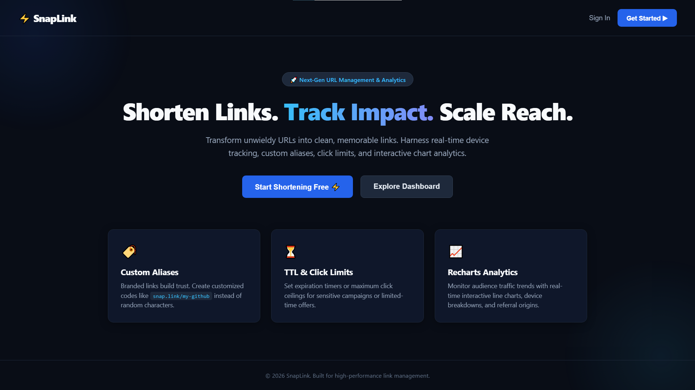
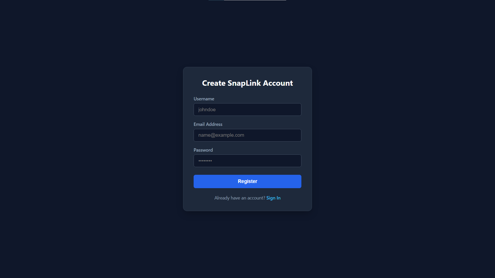
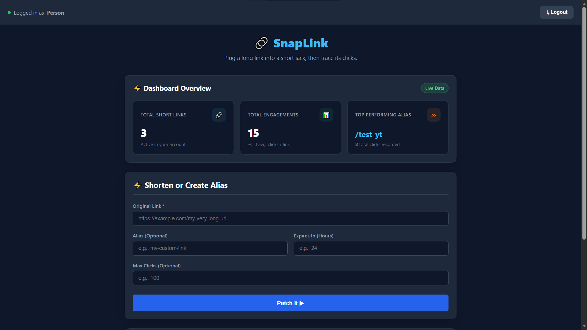
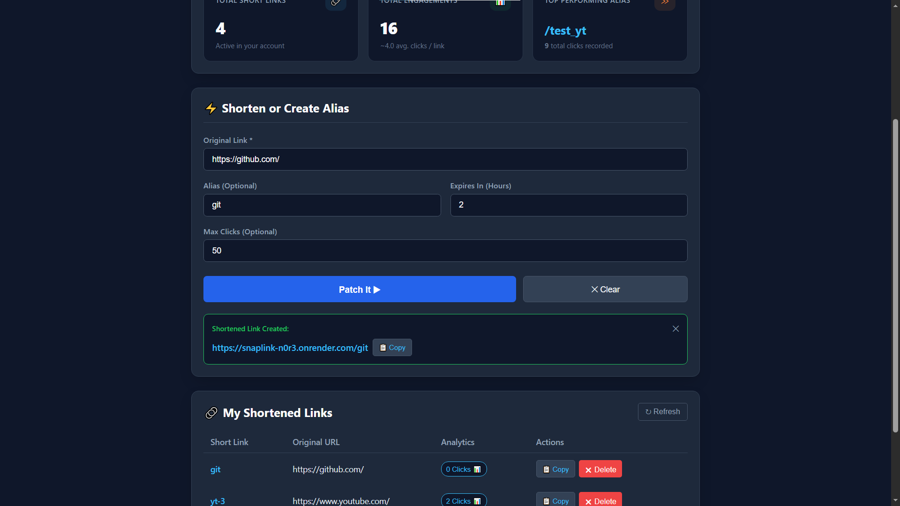
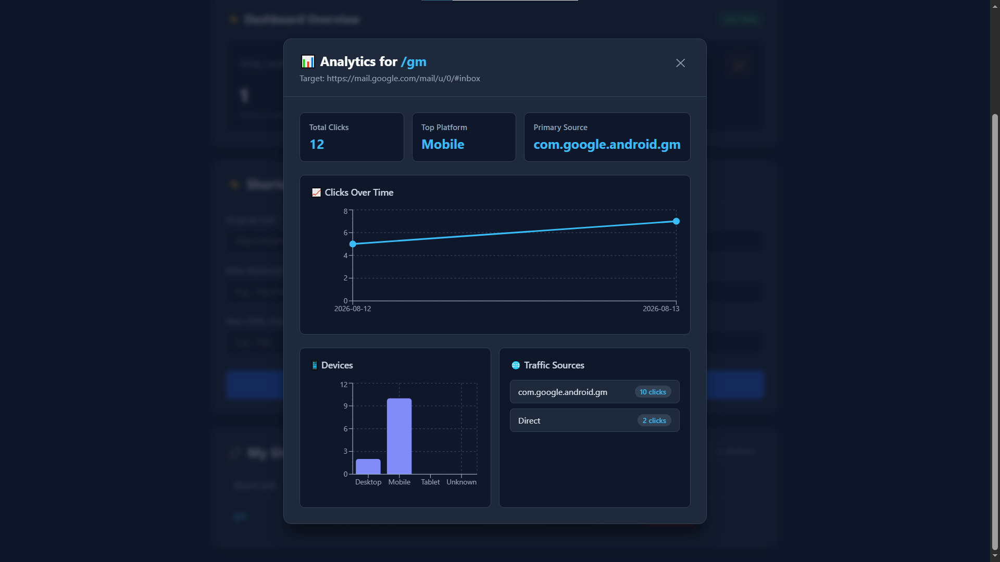
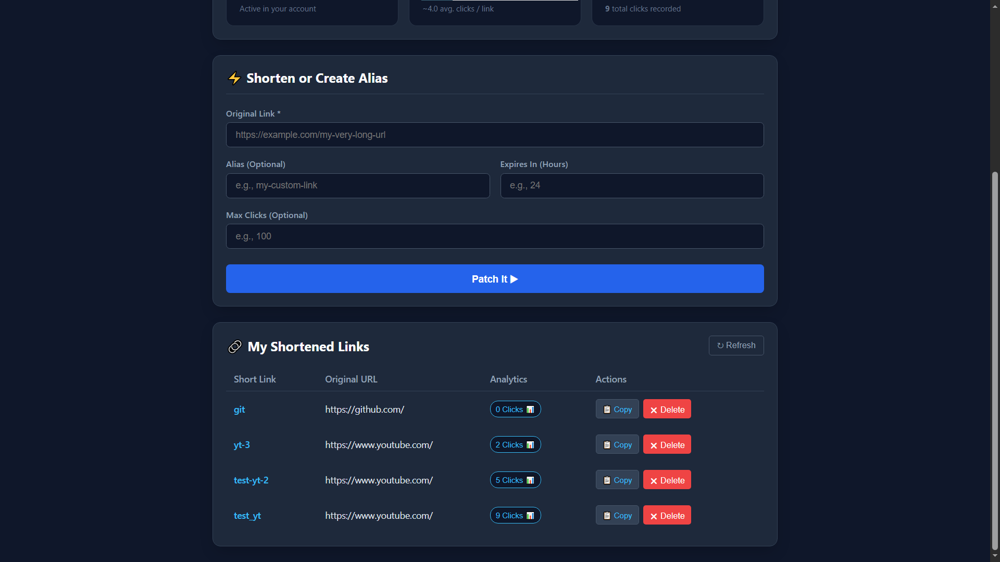
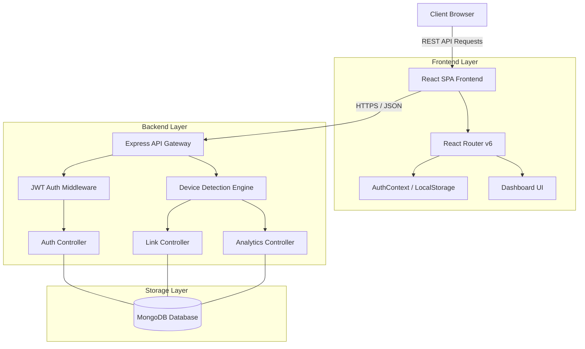

#  SnapLink

> A full-stack URL shortener and real-time link analytics platform built with React, Node.js, and Express.

[](https://reactjs.org/)
[](https://reactrouter.com/)
[](https://nodejs.org/)
[](https://expressjs.com/)
[](https://render.com/)

---

##  Overview

**SnapLink** allows users to create shortened, shareable URLs while gathering real-time click analytics. It includes a user authentication system, an interactive dashboard, and a custom analytics engine that accurately parses and categorizes device metrics across mobile, tablet, and desktop visits.

---

##  Features

* **Fast Link Shortening:** Instantly convert long, cumbersome URLs into compact, shareable links.
* **Accurate Device Analytics:** Real-time breakdown of user traffic across **Mobile**, **Tablet**, and **Desktop** platforms using `User-Agent` and `Sec-CH-UA-Mobile` Client Hints parsing.
* **Secure Authentication:** JWT-based user authentication featuring persisted sessions using `localStorage` and custom React Route Guards.
* **Responsive Dashboard:** View total clicks, active links, and analytics breakdowns on any screen size.
* **Production SPA Ready:** Fully configured with client-side routing fallback rules for zero-downtime refresh support on static hosting platforms.

---

##  Application Screenshots

###  Landing Page & User Onboarding
| Landing Page | Create Account |
| :---: | :---: |
|  |   |

---

###  Dashboard & Link Management
| Dashboard Overview | Link Creation |
| :---: | :---: |
|  |  |

---

###  Analytics & Click Metrics
| Analytics Chart | User Links Table |
| :---: | :---: |
|  |  |

##  System Architecture & System Design

SnapLink follows a decoupled **Client-Server Architecture** designed for fast link redirection, resilient authentication, and reliable device analytics processing.

---

###  High-Level Architecture Diagram




##  API Overview & Documentation

The SnapLink REST API manages user authentication, URL shortening, real-time analytics collection, and redirection.

| Configuration | Specification |
| :--- | :--- |
| **Base API URL** | `http://localhost:5000` |
| **Authentication** | `Authorization: Bearer <your_jwt_token>` |
| **Content-Type** | `application/json` |

---

###  Authentication Endpoints (`/api/auth`)

| Method | Endpoint | Access | Description |
| :--- | :--- | :--- | :--- |
| `POST` | `/api/auth/register` | **Public** | Create a new user account |
| `POST` | `/api/auth/login` | **Public** | Authenticate credentials and receive a JWT token |
| `GET` | `/api/auth/me` | **Protected** | Retrieve current user profile |


###  Link & Analytics Endpoints (`/api/links`)

| Method | Endpoint | Access | Description |
| :--- | :--- | :--- | :--- |
| `POST` | `/api/links/shorten` | **Protected** | Shorten a new long URL |
| `GET` | `/api/links` | **Protected** | Fetch all shortened links created by the user |
| `GET` | `/api/links/:id/analytics` | **Protected** | Fetch device breakdown and click history for a link |
| `DELETE` | `/api/links/:id` | **Protected** | Delete a shortened link and its associated analytics |


### Redirection Endpoint (Public)


| Method | Endpoint | Access | Description |
| :--- | :--- | :--- | :--- |
| **GET** | `/s/:shortCode` | Public | Records device analytics and issues an HTTP 302 redirect to long URL |


<br />


##  Tech Stack

### **Frontend**
* **Framework:** React.js
* **Routing:** React Router v6
* **State Management:** React Context API (`AuthContext`, `AuthProvider`)
* **Styling:** CSS3 / Modern Flexbox & Grid

### **Backend**
* **Runtime:** Node.js
* **Framework:** Express.js
* **Database:** MongoDB & Mongoose ODM
* **Authentication:** JSON Web Tokens (JWT) & `bcrypt`

### **Deployment**
* **Hosting:** Render (Static Site for Frontend, Web Service for Backend API)

---

##  Project Structure

```text
SNAPLINK/
├── url-shortener-backend/          # Express API & Backend Services
│   ├── config/
│   │   └── db.js                   # MongoDB database connection setup
│   ├── middleware/
│   │   ├── auth.js                 # JWT authentication middleware
│   │   └── rateLimiter.js          # API rate limiting middleware
│   ├── models/
│   │   ├── Url.js                  # URL and click analytics Mongoose schema
│   │   └── User.js                 # User account Mongoose schema
│   ├── routes/
│   │   ├── auth.js                 # Authentication routes (/api/auth)
│   │   ├── index.js                # Short URL redirection handler (/:code) with analytics & guardrails
│   │   └── url.js                  # URL creation & analytics routes (/api/links)
│   ├── utils/
│   │   └── securityCheck.js        # Input validation & security helpers
│   ├── .env                        # Backend environment variables
│   ├── package.json                # Backend dependencies & scripts
│   └── server.js                   # Express server entry point
│
└── url-shortener-frontend/         # React + Vite Client Application
    ├── public/                     # Static assets & favicon
    ├── src/
    │   ├── assets/                 # Media & image assets
    │   ├── components/             # Reusable UI components
    │   │   ├── AnalyticsModal.jsx  # Click metrics & analytics modal
    │   │   └── ProtectedRoute.jsx  # Authentication route guard
    │   ├── context/                # React Context state management
    │   │   ├── AuthContext.jsx     # Authentication context instance
    │   │   └── AuthProvider.jsx    # User session & token provider
    │   ├── pages/                  # Top-level page views
    │   │   ├── Dashboard.jsx       # User links & analytics dashboard
    │   │   ├── LandingPage.jsx     # Marketing landing page
    │   │   ├── Login.jsx           # User login page
    │   │   └── Register.jsx        # Account registration page
    │   ├── App.css                 # Application component styles
    │   ├── App.jsx                 # Client router setup
    │   ├── index.css               # Global CSS styles
    │   └── main.jsx                # React DOM render entry point
    ├── .env                        # Client environment variables
    ├── index.html                  # HTML template
    ├── package.json                # Frontend dependencies & scripts
    └── vite.config.js              # Vite build configuration
```

##  Installation & Setup

Follow these steps to run SnapLink locally on your machine.

---

###  Prerequisites

Ensure you have the following installed:
* [Node.js](https://nodejs.org/) (v16.0.0 or higher)
* [npm](https://www.npmjs.com/) (v8.0.0 or higher)
* [MongoDB](https://www.mongodb.com/) (Local instance or [MongoDB Atlas](https://www.mongodb.com/cloud/atlas) cluster)

---

### 1. Clone the Repository

```bash
git clone https://github.com/your-username/SnapLink.git
cd SnapLink
```
###  Backend Setup 

1. **Navigate to the backend directory:**
   ```bash
   cd url-shortener-backend
   ```

2. **Install dependencies:**
   ```bash
   npm install
   ```

3. **Configure environment variables:**
   Create a `.env` file in the `url-shortener-backend/` directory and add the following keys:
   ```env
    PORT=5000

    MONGO_URI=mongodb://localhost:27017/snaplink

    JWT_SECRET=your_super_secret_jwt_key
    CLIENT_URL=http://localhost:5173
   ```

4. **Start the Express server:**
   ```bash
   # Development mode (with auto-reload)
   npm run dev

   # Production mode
   npm start
   ```
   *The server will run at:* `http://localhost:5000`

---

###  Frontend Setup 

1. **Open a new terminal and navigate to the frontend directory:**
   ```bash
   cd url-shortener-frontend
   ```

2. **Install dependencies:**
   ```bash
   npm install
   ```

3. **Configure environment variables:**
   Create a `.env` file in the `url-shortener-frontend/` directory and add your backend API endpoint:
   ```env
   VITE_API_BASE_URL=http://localhost:5000/api
   ```

4. **Start the Vite development server:**
   ```bash
   npm run dev
   ```
   *The client application will run at:* `http://localhost:5173`

##  Configuration

SnapLink uses environment variables to handle configuration across development and production environments. Create a `.env` file in both the backend and frontend root directories using the references below.

---

### Backend Configuration (`url-shortener-backend/.env`)

| Variable | Required | Description | Example (Local) | Example (Production) |
| :--- | :---: | :--- | :--- | :--- |
| `PORT` | Yes | Port number for the Express API server | `5000` | `5000` |
| `MONGO_URI` | Yes | MongoDB connection string | `mongodb://localhost:27017/snaplink` | `mongodb+srv://<user>:<pass>@cluster.mongodb.net/snaplink` |
| `JWT_SECRET` | Yes | Secret key used to sign and verify JWT authentication tokens | `super_secret_jwt_key_123` | `a_long_random_secure_secret_string` |
| `CLIENT_URL` | Yes | Allowed Origin for CORS requests from the frontend | `http://localhost:5173` | `https://snaplink.onrender.com` |

---

### Frontend Configuration (`url-shortener-frontend/.env`)


| Variable | Required | Description | Example (Local) | Example (Production) |
| :--- | :--- | :--- | :--- | :--- |
| `VITE_API_BASE_URL` | Yes | Base URL endpoint for all backend API requests | `http://localhost:5000/api` | `https://snaplink-n0r3.onrender.com/api` |
